# Link para acessar a Plataforma:

# <a href="https://evil-levi.01424210.xyz/" target="_blank" rel="noopener" style="font-size: 24px;">Clique aqui para acessar o link para a plataforma:</a>

# https://evil-levi.01424210.xyz/

# Contraponto — frontend

React/TypeScript. A instalação completa inclui o backend e o PostgreSQL.

## Arquitetura

O diagrama mostra a comunicação entre frontend, API, agente, ferramentas,
fontes de dados e sandbox de execução.


### Agente LangGraph

Grafo exportado diretamente com `GRAPH_BUILDER.get_graph().draw_mermaid()`.
As setas condicionais mostram os destinos declarados; durante a execução,
o roteamento escolhe o caminho conforme o estado da conversa.



As figuras são cópias dos SVGs de `back-end/docs`. Consulte a
[documentação da arquitetura no backend](https://github.com/evil-ideias-em-rede/back-end/blob/microsandbox/docs/arquitetura-contraponto.md)
para os endpoints, os dados enviados e as ferramentas disponíveis em cada modo.

## Instalação Linux com Docker/KVM

Clone `front-end` e `back-end` da mesma versão em pastas irmãs. Siga
[as instruções do backend](../back-end/README.md) e rode, dentro de `back-end`:

```bash
bash scripts/install.sh
```

O Dockerfile tem dois modos:

- `production`: build estático servido por Nginx, sem Node/npm no runtime.
  API e WebSocket passam pelo mesmo endereço da interface. Nenhuma chave de IA
  deve ser enviada ao build do frontend.
- `development`: Vite com hot reload; usado pelo compose de desenvolvimento
  do backend, preservando o fluxo anterior.

## Desenvolvimento sem Docker

```bash
npm ci
npm run dev
```

Configure `VITE_API_URL` em um arquivo local conforme `.env.example`.
Sem configuração, o modo de desenvolvimento usa `http://localhost:8006`.
O modo de produção usa a própria origem e precisa do proxy configurado.

`npm run build` verifica TypeScript e gera `dist/`.
`npm run lint` executa a análise estática.
